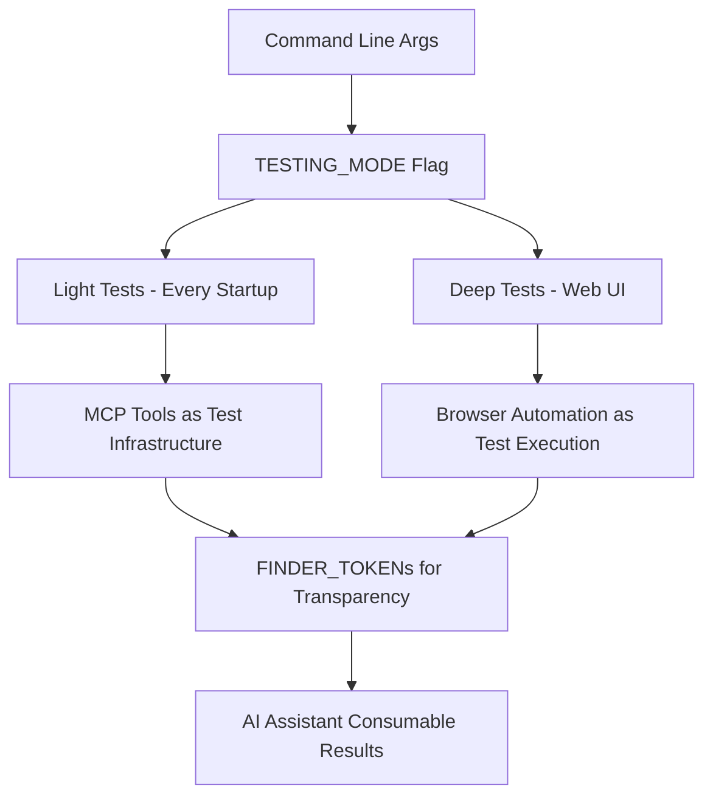

# Pipulate Testing Strategy: Revolutionary Approach

**🧪 THE PIPULATE TESTING PHILOSOPHY - TESTS ARE JUST ANOTHER WORKFLOW**

This document outlines Pipulate's revolutionary testing approach that leverages our existing **MCP tools**, **browser automation**, and **radical transparency** infrastructure for a testing system that embodies our core philosophy.

---

## 🚨 **CRITICAL INSIGHT: Why Traditional Testing Approaches Don't Fit**

### **Unit Testing Approach** ❌
```python
class TestMCPTools(unittest.TestCase):
    def test_pipeline_state_inspector(self):
        # Traditional isolation testing with mocks
        pass
```
**Problems:**
- Requires extensive mocking of our integrated system
- Doesn't test real MCP tool interactions
- Misses the radical transparency benefits
- External dependency (unittest framework)
- Doesn't leverage our browser automation capabilities

### **Pytest Approach** ❌  
```python
def test_mcp_integration(client):
    # Fixture-based testing, still external
    pass
```
**Problems:**
- Still external to our system architecture
- Separate test runner outside our sovereignty
- Doesn't use our existing MCP tools as test infrastructure
- Misses the opportunity to test via browser automation

### **Pipulate-Native Testing Approach** ✅ (RECOMMENDED)
```python
# Built into server.py with radical transparency
TESTING_MODE = True

async def run_light_tests():
    """Use existing MCP tools for testing - this IS the integration test"""
    return await mcp_tool_executor({
        "tool_name": "pipeline_state_inspector",
        "parameters": {"test_mode": True}
    })
```
**Advantages:**
- **Uses existing MCP tools** - Real integration testing without mocks
- **Browser automation ready** - Tests actual UI workflows
- **Radical transparency** - All results logged with FINDER_TOKENs
- **Local-first sovereignty** - No external test frameworks
- **AI-friendly results** - Test outputs consumable by AI assistants

---

## 🏆 **THE REVOLUTIONARY PIPULATE TESTING ARCHITECTURE**

### **Core Philosophy: "Tests Are Just Another Workflow"**



### **🎯 Three-Tier Testing Strategy**

#### **Tier 1: Light Tests (Every Server Start)**
- **Duration**: ~5 seconds
- **Scope**: Core functionality validation
- **Tools**: Existing MCP tools
- **Trigger**: `python server.py -t`

#### **Tier 2: Deep Tests (Web UI Triggered)**  
- **Duration**: ~30 seconds
- **Scope**: Comprehensive workflows + browser automation
- **Tools**: Full MCP tool suite + Selenium
- **Trigger**: Settings → "Run Tests" button

#### **Tier 3: Regression Tests (CI/Manual)**
- **Duration**: ~2 minutes  
- **Scope**: Complete system validation
- **Tools**: Enterprise consolidation tools + browser walkthrough
- **Trigger**: `python server.py --test-deep`

---

## 🚀 **IMPLEMENTATION ARCHITECTURE**

### **1. Command Line Interface (Friction-Free)**

```python
# Already implemented in server.py - perfect foundation!
parser = argparse.ArgumentParser(description='Pipulate - Local-First Digital Workshop Framework')
parser.add_argument('-t', '--test', '--tests', action='store_true', 
                   help='Enable light testing mode')
parser.add_argument('--test-deep', action='store_true',
                   help='Enable comprehensive testing mode')  
parser.add_argument('--test-browser', action='store_true',
                   help='Enable browser automation testing')

# Global flags following existing DEBUG_MODE pattern
TESTING_MODE = args.test or args.test_deep or args.test_browser
DEEP_TESTING = args.test_deep
BROWSER_TESTING = args.test_browser
```

### **2. Light Tests Using Existing MCP Tools**

```python
async def run_light_tests():
    """
    Friction-free testing using our revolutionary MCP tool infrastructure.
    This leverages the same tools AI assistants use - perfect integration!
    """
    test_results = []
    
    # Test 1: Core MCP Tools (THE GAME CHANGERS)
    core_tools = [
        "pipeline_state_inspector",  # The debugging revolution
        "local_llm_read_file",       # File access verification  
        "local_llm_grep_logs",       # Log analysis capability
        "ui_flash_element"           # UI interaction testing
    ]
    
    for tool_name in core_tools:
        try:
            # Use our existing mcp_tool_executor - this IS the integration test!
            result = await mcp_tool_executor({
                "tool_name": tool_name,
                "parameters": {"test_mode": True, "validate_only": True}
            })
            
            test_results.append({
                "test": f"MCP Tool: {tool_name}",
                "status": "✅ PASS" if result.get("success") else "❌ FAIL",
                "execution_time": result.get("execution_time_ms", 0),
                "details": result.get("result", {})
            })
            
        except Exception as e:
            test_results.append({
                "test": f"MCP Tool: {tool_name}",
                "status": "❌ FAIL",
                "error": str(e),
                "finder_token": f"TEST_FAIL_MCP_{tool_name.upper()}"
            })
    
    # Test 2: Database Operations (Using Existing Pipeline Table)
    try:
        # Test using our existing pipeline infrastructure
        test_pipeline_id = f"test-{int(time.time())}"
        
        # Use existing Pipulate methods for database testing
        import sys
        server_module = sys.modules.get('server')
        if server_module and hasattr(server_module, 'pipulate'):
            pipulate = server_module.pipulate
            
            # Write test state
            test_state = {"test": True, "timestamp": time.time()}
            pipulate.write_state(test_pipeline_id, test_state)
            
            # Read back test state  
            retrieved_state = pipulate.read_state(test_pipeline_id)
            
            # Cleanup
            pipeline_table.delete_where("pipeline_id = ?", [test_pipeline_id])
            
            success = retrieved_state.get("test") == True
            test_results.append({
                "test": "Database Operations",
                "status": "✅ PASS" if success else "❌ FAIL",
                "details": f"Write/Read cycle successful: {success}"
            })
            
    except Exception as e:
        test_results.append({
            "test": "Database Operations",
            "status": "❌ FAIL",
            "error": str(e),
            "finder_token": "TEST_FAIL_DATABASE"
        })
    
    # Test 3: Botify API Integration (If Available)
    try:
        botify_result = await mcp_tool_executor({
            "tool_name": "botify_ping",
            "parameters": {"test_mode": True}
        })
        
        test_results.append({
            "test": "Botify API Connection",
            "status": "✅ PASS" if botify_result.get("success") else "⚠️ SKIP",
            "details": botify_result.get("message", "API connection test")
        })
        
    except Exception:
        test_results.append({
            "test": "Botify API Connection", 
            "status": "⚠️ SKIP",
            "details": "Botify API not configured (expected in dev)"
        })
    
    return test_results
```

### **3. Browser Automation Tests (Revolutionary Integration)**

```python
async def run_browser_tests():
    """
    REVOLUTIONARY: Use our existing browser automation MCP tools for UI testing.
    This leverages _browser_automate_workflow_walkthrough - our AI HANDS!
    """
    test_results = []
    
    # Test 1: Hello Workflow Automation
    try:
        result = await mcp_tool_executor({
            "tool_name": "browser_automate_workflow_walkthrough",
            "parameters": {
                "plugin": "hello_workflow",
                "headless": True,
                "take_screenshots": False,
                "test_mode": True,
                "validation_mode": True
            }
        })
        
        test_results.append({
            "test": "Browser Automation - Hello Workflow",
            "status": "✅ PASS" if result.get("success") else "❌ FAIL",
            "steps_completed": len(result.get("workflow_steps", [])),
            "execution_time": result.get("execution_time_ms", 0),
            "details": result.get("automation_summary", {})
        })
        
    except Exception as e:
        test_results.append({
            "test": "Browser Automation - Hello Workflow",
            "status": "❌ FAIL",
            "error": str(e),
            "finder_token": "TEST_FAIL_BROWSER_AUTOMATION"
        })
    
    # Test 2: DOM Scraping Verification
    try:
        result = await mcp_tool_executor({
            "tool_name": "browser_scrape_page",
            "parameters": {
                "url": "http://localhost:5001",
                "test_mode": True,
                "validate_structure": True
            }
        })
        
        test_results.append({
            "test": "Browser DOM Scraping",
            "status": "✅ PASS" if result.get("success") else "❌ FAIL",
            "elements_found": len(result.get("elements", [])),
            "details": result.get("validation_summary", {})
        })
        
    except Exception as e:
        test_results.append({
            "test": "Browser DOM Scraping",
            "status": "❌ FAIL", 
            "error": str(e),
            "finder_token": "TEST_FAIL_DOM_SCRAPING"
        })
    
    return test_results
```

### **4. Deep Testing via Web UI Plugin**

```python
# File: plugins/999_testing_suite.py
class TestingSuite:
    APP_NAME = "testing"
    DISPLAY_NAME = "🧪 Testing Suite"
    ROLES = ['Developer', 'Core']
    
    def __init__(self, app, pipulate, **kwargs):
        self.app = app
        self.pipulate = pipulate
        self.steps = [
            Step(id='test_selection', done='tests_selected', show='Select Test Categories'),
            Step(id='run_tests', done='tests_complete', show='Execute Tests'),
            Step(id='results', done='results_viewed', show='View Results & Analysis')
        ]
        pipulate.register_workflow_routes(self)
    
    async def test_selection(self, request):
        """Beautiful UI for selecting comprehensive tests"""
        return Form(
            H3("🧪 Pipulate Testing Suite"),
            P("Select test categories to run:", cls='text-secondary'),
            
            Fieldset(
                Legend("Test Categories"),
                Label(
                    Input(type="checkbox", name="mcp_tests", checked=True),
                    "🔧 MCP Tools Integration (Core)"
                ),
                Label(
                    Input(type="checkbox", name="browser_tests"),
                    "🌐 Browser Automation (UI Workflows)"  
                ),
                Label(
                    Input(type="checkbox", name="plugin_tests"),
                    "🔌 Plugin Workflows (Complete Chains)"
                ),
                Label(
                    Input(type="checkbox", name="botify_tests"),
                    "📊 Botify API Integration (External)"
                ),
                Label(
                    Input(type="checkbox", name="regression_tests"),
                    "🛡️ Regression Tests (Full System)"
                )
            ),
            
            Fieldset(
                Legend("Test Options"),
                Label(
                    Input(type="checkbox", name="take_screenshots"),
                    "📸 Take Screenshots (Browser Tests)"
                ),
                Label(
                    Input(type="checkbox", name="detailed_logging"),
                    "📝 Detailed Logging (All FINDER_TOKENs)"
                ),
                Label(
                    Input(type="checkbox", name="performance_metrics"),
                    "⚡ Performance Metrics (Timing Analysis)"
                )
            ),
            
            Button("🚀 Run Selected Tests", type="submit", cls='primary'),
            method="post",
            hx_post=f"/{self.APP_NAME}/run_tests",
            hx_target=f"#{self.APP_NAME}",
            hx_swap="outerHTML"
        )
```

---

## 🔥 **RADICAL TRANSPARENCY INTEGRATION**

### **FINDER_TOKEN Strategy for Test Results**

```python
def log_test_results(test_results, test_category="LIGHT"):
    """
    Log all test results with FINDER_TOKENs for complete searchability.
    This maintains our radical transparency philosophy.
    """
    # Summary FINDER_TOKEN
    total_tests = len(test_results)
    passed_tests = len([r for r in test_results if r["status"] == "✅ PASS"])
    failed_tests = len([r for r in test_results if "❌ FAIL" in r["status"]])
    
    logger.info(f"🧪 FINDER_TOKEN: TEST_SUITE_{test_category}_SUMMARY - "
                f"{passed_tests}/{total_tests} passed, {failed_tests} failed")
    
    # Individual test FINDER_TOKENs
    for result in test_results:
        if result["status"] == "✅ PASS":
            logger.info(f"🧪 FINDER_TOKEN: TEST_PASS_{test_category} - "
                       f"{result['test']} | Time: {result.get('execution_time', 0)}ms")
        else:
            logger.error(f"🧪 FINDER_TOKEN: TEST_FAIL_{test_category} - "
                        f"{result['test']} | Error: {result.get('error', 'Unknown')}")
    
    # AI Assistant Summary
    logger.info(f"🤖 FINDER_TOKEN: AI_TEST_SUMMARY_{test_category} - "
                f"Test results logged for AI assistant analysis and debugging")
```

### **Integration with Existing Startup Sequence**

```python
# In startup_event(), add testing hooks
@app.on_event('startup')
async def startup_event():
    # ... existing startup code ...
    
    # Add testing integration
    if TESTING_MODE:
        logger.info("🧪 FINDER_TOKEN: TESTING_STARTUP - Running light test suite")
        
        try:
            test_results = await run_light_tests()
            log_test_results(test_results, "STARTUP")
            
            # Show beautiful test summary
            total_tests = len(test_results)
            passed_tests = len([r for r in test_results if r["status"] == "✅ PASS"])
            
            figlet_banner(f"TESTS: {passed_tests}/{total_tests}", 
                         "Light test suite completed", 
                         font='slant', 
                         color='green' if passed_tests == total_tests else 'yellow')
                         
        except Exception as e:
            logger.error(f"🧪 FINDER_TOKEN: TESTING_STARTUP_ERROR - {e}")
```

---

## 🛡️ **REGRESSION TESTING STRATEGY**

### **Leverage Enterprise Consolidation Tools**

```python
async def run_regression_tests():
    """
    Revolutionary regression testing using our enterprise consolidation infrastructure.
    This reuses patterns from bulletproof_consolidation.py and our verification tools!
    """
    regression_results = []
    
    # 1. MCP Tools Verification (Using Our Existing Test Script)
    try:
        # This reuses our bulletproof consolidation verification approach
        result = subprocess.run([
            'bash', 
            'helpers/cleanup/test_mcp_tools_integration.sh'
        ], capture_output=True, text=True, timeout=30)
        
        regression_results.append({
            "test": "MCP Tools Integration Verification",
            "status": "✅ PASS" if result.returncode == 0 else "❌ FAIL",
            "stdout": result.stdout,
            "stderr": result.stderr,
            "finder_token": "REGRESSION_MCP_INTEGRATION"
        })
        
    except Exception as e:
        regression_results.append({
            "test": "MCP Tools Integration Verification",
            "status": "❌ FAIL",
            "error": str(e),
            "finder_token": "REGRESSION_MCP_INTEGRATION_ERROR"
        })
    
    # 2. Browser Automation Regression
    try:
        # Use our existing workflow walkthrough for regression testing
        browser_results = await mcp_tool_executor({
            "tool_name": "browser_automate_workflow_walkthrough",
            "parameters": {
                "plugin": "hello_workflow",
                "regression_mode": True,
                "compare_previous_runs": True,
                "take_screenshots": True
            }
        })
        
        regression_results.append({
            "test": "Browser Automation Regression",
            "status": "✅ PASS" if browser_results.get("success") else "❌ FAIL",
            "workflow_steps": browser_results.get("workflow_steps", []),
            "screenshots_taken": browser_results.get("screenshots_count", 0),
            "finder_token": "REGRESSION_BROWSER_AUTOMATION"
        })
        
    except Exception as e:
        regression_results.append({
            "test": "Browser Automation Regression",
            "status": "❌ FAIL",
            "error": str(e),
            "finder_token": "REGRESSION_BROWSER_ERROR"
        })
    
    # 3. Data Integrity Verification
    try:
        # Use our revolutionary pipeline_state_inspector for data validation
        state_results = await mcp_tool_executor({
            "tool_name": "pipeline_state_inspector",
            "parameters": {
                "show_data": True,
                "format": "validation",
                "regression_mode": True
            }
        })
        
        regression_results.append({
            "test": "Data Integrity Verification",
            "status": "✅ PASS" if state_results.get("success") else "❌ FAIL",
            "pipelines_validated": state_results.get("total_pipelines", 0),
            "data_integrity_score": state_results.get("integrity_score", 0),
            "finder_token": "REGRESSION_DATA_INTEGRITY"
        })
        
    except Exception as e:
        regression_results.append({
            "test": "Data Integrity Verification",
            "status": "❌ FAIL",
            "error": str(e),
            "finder_token": "REGRESSION_DATA_ERROR"
        })
    
    return regression_results
```

---

## 🎯 **IMPLEMENTATION PHASES**

### **Phase 1: Foundation (Current Session)**
- ✅ Command line argument parsing (already implemented!)
- ✅ TESTING_MODE global flag following DEBUG_MODE pattern
- ✅ Testing mode banners and FINDER_TOKENs
- 🔄 Add basic `run_light_tests()` function

### **Phase 2: Core Light Testing (Next Session)**
- Implement MCP tool validation using existing `mcp_tool_executor`
- Database operations testing using existing pipeline infrastructure
- Test result logging with FINDER_TOKENs
- Integration with startup sequence

### **Phase 3: Browser Automation Testing (Future)**
- Leverage `_browser_automate_workflow_walkthrough` for UI testing
- DOM scraping validation using `_browser_scrape_page`
- Screenshot comparison for visual regression testing
- Integration with `looking_at/` directory for result capture

### **Phase 4: Web UI Testing Suite (Future)**
- Create `plugins/999_testing_suite.py` plugin
- Beautiful UI for test selection and execution
- Real-time test progress via WebSocket integration
- Comprehensive test reporting with visual results

### **Phase 5: Enterprise Regression Testing (Advanced)**
- Integration with consolidation verification tools
- Automated regression testing on file changes
- Performance benchmarking and trend analysis
- CI/CD pipeline integration (if desired)

---

## 🏆 **THE REVOLUTIONARY ADVANTAGE**

### **Why This Approach Changes Everything**

#### **For AI Assistants**
- **Real Integration Testing** - Tests use the same MCP tools AI assistants use
- **Complete Transparency** - All test results searchable via FINDER_TOKENs
- **Context Awareness** - Tests run in the same environment as normal operations
- **Browser Embodiment** - AI can test the same UI workflows users experience

#### **For Developers**
- **Zero External Dependencies** - Uses existing Pipulate infrastructure
- **Friction-Free Execution** - `python server.py -t` just works
- **Real-World Validation** - Tests actual system behavior, not mocked components
- **Visual Feedback** - Beautiful banners and progress indicators

#### **For System Reliability**
- **Continuous Validation** - Light tests with every server start
- **Regression Protection** - Deep tests catch breaking changes
- **Performance Monitoring** - Built-in timing and performance metrics
- **End-to-End Coverage** - Tests span from MCP tools to browser automation

### **Philosophical Alignment**
- **Local-First Testing** - No external test services or cloud dependencies
- **Radical Transparency** - Every test operation is logged and searchable
- **Sovereignty Preservation** - Complete control over testing infrastructure
- **AI-Collaborative** - Tests designed for AI assistant consumption and analysis

---

## 🚀 **IMMEDIATE NEXT STEPS**

### **The Smallest Possible Baby-Step**
1. **Verify current argument parsing** - Test `python server.py -t`
2. **Add basic `run_light_tests()` stub** - Foundation for immediate expansion
3. **Integrate with startup sequence** - Hook testing into existing startup_event
4. **Add test result logging** - FINDER_TOKENs for radical transparency

### **Command Interface Ready**
```bash
python server.py -t              # Light tests (5 seconds)
python server.py --test          # Same as -t
python server.py --tests         # Same as -t  
python server.py --test-deep     # Comprehensive tests (30 seconds)
python server.py --test-browser  # Browser automation tests (60 seconds)
```

**This testing strategy doesn't just test Pipulate - it embodies the Pipulate philosophy of radical transparency, local-first sovereignty, and AI-collaborative development!** 🎯

**REVOLUTIONARY INSIGHT: Our testing system IS our MCP tool system IS our browser automation system. They're not separate - they're the same infrastructure viewed from a validation perspective. This is the breakthrough that makes testing feel natural rather than burdensome.** 