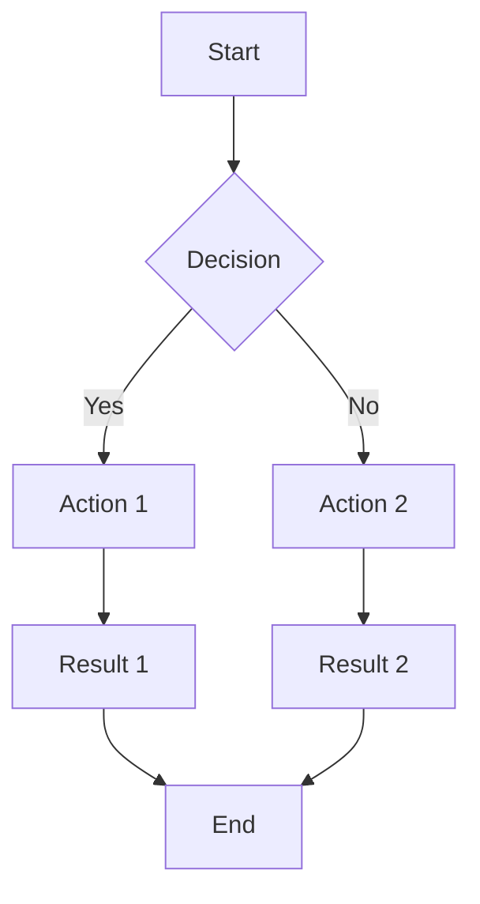
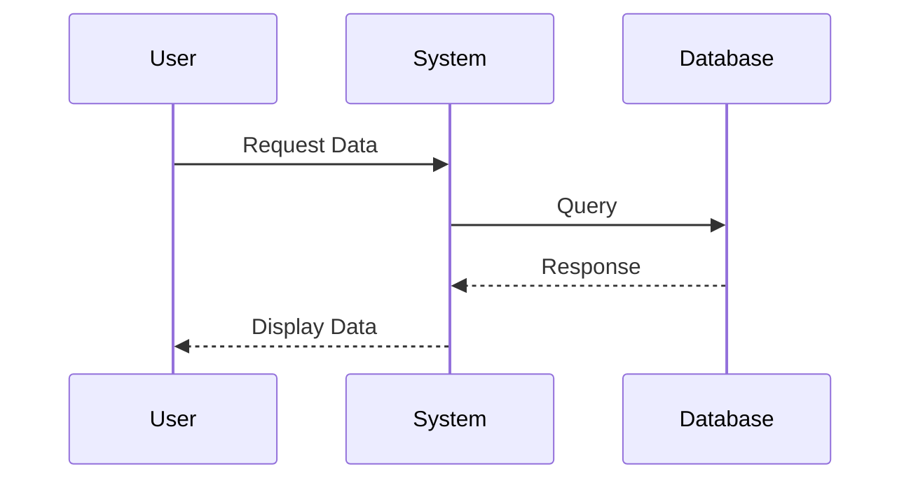

# Mermaid Diagram Widget Recipe

This recipe demonstrates how to create a widget that renders Mermaid diagrams. It's based on the Mermaid diagram implementation in [520_widget_examples.py](../../plugins/520_widget_examples.py).

## Key Features
- Client-side diagram rendering
- Multiple diagram types support
- Live preview capability
- State preservation
- Re-render capability

## Implementation

### Step Definition
```python
Step(
    id='step_XX',
    done='mermaid_content',  # Store the diagram syntax
    show='Mermaid Diagram',
    refill=True,            # Allow content reuse
)
```

### Helper Methods
```python
def create_mermaid_widget(self, diagram_syntax, widget_id):
    """Create a mermaid diagram widget container."""
    # Create container for the widget
    container = Div(
        Div(
            # Container to render the mermaid diagram
            H5("Rendered Diagram:"),
            Div(
                # This div with class="mermaid" will be targeted by the mermaid.js library
                Div(
                    diagram_syntax,
                    cls="mermaid",
                    style="width: 100%; background-color: var(--pico-card-background-color); border-radius: var(--pico-border-radius); padding: 1rem;"
                ),
                id=f"{widget_id}_output"
            )
        ),
        id=widget_id
    )
    
    # Create a script to initialize and run mermaid on this container
    init_script = Script(
        f"""
        (function() {{
            // Give the DOM time to fully render before initializing Mermaid
            setTimeout(function() {{
                // Initialize mermaid
                if (typeof mermaid !== 'undefined') {{
                    try {{
                        mermaid.initialize({{ 
                            startOnLoad: false,  // Important - don't auto-init
                            theme: 'dark',       // Use dark theme for better visibility
                            securityLevel: 'loose',
                            flowchart: {{
                                htmlLabels: true
                            }}
                        }});
                        
                        // Find all mermaid divs in this widget and render them
                        const container = document.getElementById('{widget_id}');
                        if (!container) return;
                        
                        const mermaidDiv = container.querySelector('.mermaid');
                        if (mermaidDiv) {{
                            // Force a repaint before initializing
                            void container.offsetWidth;
                            
                            // Render the diagram
                            if (typeof mermaid.run === 'function') {{
                                // Newer Mermaid API
                                mermaid.run({{ nodes: [mermaidDiv] }});
                            }} else {{
                                // Older Mermaid API
                                mermaid.init(undefined, mermaidDiv);
                            }}
                            console.log('Mermaid rendering successful');
                        }}
                    }} catch(e) {{
                        console.error("Mermaid rendering error:", e);
                    }}
                }} else {{
                    console.error("Mermaid library not found. Make sure it's included in the page headers.");
                }}
            }}, 300); // 300ms delay to ensure DOM is ready
        }})();
        """,
        type="text/javascript"
    )
    
    return Div(container, init_script)
```

### GET Handler
```python
async def step_XX(self, request):
    """Handles GET request for Mermaid diagram step."""
    pip, db, steps, app_name = self.pipulate, self.db, self.steps, self.app_name
    step_id = "step_XX"
    step_index = self.steps_indices[step_id]
    step = steps[step_index]
    next_step_id = steps[step_index + 1].id if step_index < len(steps) - 1 else 'finalize'
    pipeline_id = db.get("pipeline_id", "unknown")
    state = pip.read_state(pipeline_id)
    step_data = pip.get_step_data(pipeline_id, step_id, {})
    diagram_syntax = step_data.get(step.done, "")

    # Check if workflow is finalized
    finalize_data = pip.get_step_data(pipeline_id, "finalize", {})
    if "finalized" in finalize_data and diagram_syntax:
        try:
            widget_id = f"mermaid-widget-{pipeline_id.replace('-', '_')}-{step_id}"
            mermaid_widget = self.create_mermaid_widget(diagram_syntax, widget_id)
            
            # Create response with locked view
            response = HTMLResponse(
                to_xml(
                    Div(
                        Card(
                            H3(f"🔒 {step.show}"),
                            mermaid_widget
                        ),
                        Div(id=next_step_id, hx_get=f"/{app_name}/{next_step_id}", hx_trigger="load")
                    )
                )
            )
            
            # Add HX-Trigger to render the Mermaid diagram
            response.headers["HX-Trigger"] = json.dumps({
                "renderMermaid": {
                    "targetId": f"{widget_id}_output",
                    "diagram": diagram_syntax
                }
            })
            
            return response
        except Exception as e:
            logger.error(f"Error creating mermaid widget in locked view: {str(e)}")
            return Div(
                Card(f"🔒 {step.show}: <content locked>"),
                Div(id=next_step_id, hx_get=f"/{app_name}/{next_step_id}", hx_trigger="load")
            )
            
    # Check if step is complete and not being reverted to
    if diagram_syntax and state.get("_revert_target") != step_id:
        try:
            widget_id = f"mermaid-widget-{pipeline_id.replace('-', '_')}-{step_id}"
            mermaid_widget = self.create_mermaid_widget(diagram_syntax, widget_id)
            content_container = pip.widget_container(
                step_id=step_id,
                app_name=app_name,
                message=f"{step.show} Configured",
                widget=mermaid_widget,
                steps=steps
            )
            
            # Create response with HTMX trigger
            response = HTMLResponse(
                to_xml(
                    Div(
                        content_container,
                        Div(id=next_step_id, hx_get=f"/{app_name}/{next_step_id}", hx_trigger="load")
                    )
                )
            )
            
            # Add HX-Trigger to render the Mermaid diagram
            response.headers["HX-Trigger"] = json.dumps({
                "renderMermaid": {
                    "targetId": f"{widget_id}_output",
                    "diagram": diagram_syntax
                }
            })
            
            return response
        except Exception as e:
            # If there's an error creating the widget, revert to input form
            logger.error(f"Error creating mermaid widget: {str(e)}")
            state["_revert_target"] = step_id
            pip.write_state(pipeline_id, state)
    
    # Show input form
    display_value = diagram_syntax if step.refill and diagram_syntax else await self.get_suggestion(step_id, state)
    await self.message_queue.add(pip, self.step_messages[step_id]["input"], verbatim=True)
    
    return Div(
        Card(
            H3(f"{step.show}"),
            P("Enter Mermaid diagram syntax. Example is pre-populated."),
            P("Supports flowcharts, sequence diagrams, class diagrams, etc.", 
              style="font-size: 0.8em; font-style: italic;"),
            Form(
                Div(
                    Textarea(
                        display_value,
                        name=step.done,
                        placeholder="Enter Mermaid diagram syntax",
                        required=True,
                        rows=15,
                        style="width: 100%; font-family: monospace;"
                    ),
                    Div(
                        Button("Create Diagram ▸", type="submit", cls="primary"),
                        style="margin-top: 1vh; text-align: right;"
                    ),
                    style="width: 100%;"
                ),
                hx_post=f"/{app_name}/{step_id}_submit",
                hx_target=f"#{step_id}"
            )
        ),
        Div(id=next_step_id),
        id=step_id
    )
```

### SUBMIT Handler
```python
async def step_XX_submit(self, request):
    """Process the Mermaid diagram submission."""
    pip, db, steps, app_name = self.pipulate, self.db, self.steps, self.app_name
    step_id = "step_XX"
    step_index = self.steps_indices[step_id]
    step = steps[step_index]
    next_step_id = steps[step_index + 1].id if step_index < len(steps) - 1 else 'finalize'
    pipeline_id = db.get("pipeline_id", "unknown")

    # Get form data
    form = await request.form()
    diagram_syntax = form.get(step.done, "")

    # Validate input
    if not diagram_syntax:
        return P("Error: Diagram syntax is required", style=pip.get_style("error"))

    # Save the content to state
    await pip.update_step_state(pipeline_id, step_id, diagram_syntax, steps)
    
    # Generate unique widget ID
    widget_id = f"mermaid-widget-{pipeline_id.replace('-', '_')}-{step_id}"
    
    # Use the helper method to create a mermaid widget
    mermaid_widget = self.create_mermaid_widget(diagram_syntax, widget_id)
    
    # Create content container with the widget
    content_container = pip.widget_container(
        step_id=step_id,
        app_name=app_name,
        message=f"{step.show}: Client-side Mermaid diagram rendering",
        widget=mermaid_widget,
        steps=steps
    )
    
    # Create full response structure
    response_content = Div(
        content_container,
        Div(id=next_step_id, hx_get=f"/{app_name}/{next_step_id}", hx_trigger="load"),
        id=step_id
    )
    
    # Create an HTMLResponse with the content
    response = HTMLResponse(to_xml(response_content))
    
    # Add HX-Trigger header to render the Mermaid diagram
    response.headers["HX-Trigger"] = json.dumps({
        "renderMermaid": {
            "targetId": f"{widget_id}_output",
            "diagram": diagram_syntax
        }
    })
    
    # Send confirmation message
    await self.message_queue.add(pip, f"{step.show} complete. Mermaid diagram rendered.", verbatim=True)
    
    return response
```

## Required Client-Side Libraries

The widget requires Mermaid.js. Include in your application's headers:
```html
<script src="https://cdn.jsdelivr.net/npm/mermaid/dist/mermaid.min.js"></script>
```

## HTMX Integration

The widget uses HTMX triggers for rendering:
1. Initial render via HX-Trigger header
2. Re-render on DOM updates
3. Chain reaction preservation
4. State management

## Chain Reaction Pattern

The widget maintains the critical chain reaction pattern:
```python
Div(
    content_container,
    Div(id=next_step_id, hx_get=f"/{app_name}/{next_step_id}", hx_trigger="load"),
    id=step_id
)
```

## State Management

The widget:
1. Stores diagram syntax in pipeline state
2. Allows content reuse with `refill=True`
3. Clears state properly on revert
4. Handles finalization correctly

## Error Handling

The widget includes:
1. Diagram parsing error handling
2. Required field checking
3. Clear error messages
4. Consistent error styling

## Example Usage

```python
# In workflow initialization
steps = [
    Step(
        id='step_01',
        done='mermaid_content',
        show='Mermaid Diagram',
        refill=True,
    ),
    # ... other steps
]
```

## Example Diagram Syntax

1. Flowchart


2. Sequence Diagram


## Customization Points

1. Diagram Rendering
   - Configure Mermaid options
   - Change themes
   - Add custom styles

2. Initialization
   - Adjust timing
   - Add error recovery
   - Enhance feedback

3. UI Components
   - Customize container styles
   - Add preview mode
   - Enhance error display

## Common Issues

1. Rendering
   - Symptom: Diagram not rendered
   - Solution: Check Mermaid loading

2. Timing
   - Symptom: Partial rendering
   - Solution: Adjust initialization delay

3. Chain Reaction
   - Symptom: No progression
   - Solution: Verify pattern 